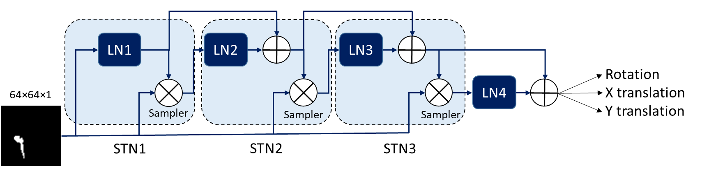

# Comprehensize study of CNN regressors for finding orientation of cervical brachytherapy applicator

Implementation of STN (Spatial Transformer Network) and ICSTN (Inverse Compositional Spatial Transformer Networks) in Tensorlayer to predict transformation parameters from 2D images. This was implemented for estimating orientation of the cervical brachytherapy applicator from MRI scans. Check the report below for full details. 

[<a href="https://github.com/tajwarabraraleef/Registration-using-CNN-STN-ICSTN/blob/master/assets/report/Comprehensize%20study%20of%20CNN%20regressors.pdf" target="_blank">Report</a>]

<p align="left">
<a href="#"></a>
</p>

### Dependencies
```
Python 3.5
Tensorflow: 1.2.0
Tensorlayer: 1.6.0
```

### Dataset

For this work, synthesized data was used. Both the noisy and binary data are available under `\dataset\dataset.rar`.

### Training

The code for each setting used in the report are provided. Based on which setting you want to run, follow the corresponding folder and find the `cnn_regressor.py` file. Update the directory of the dataset and run to start training. 

* simple_cnn folder contains a simple implementation of using CNN to predict transformation parameters from simple 2D images

* with_stn folder contains the follow implementations:
  1) stn_with_addition: where the transformation parameters are simply added after every stn before the next localization network.
  2) stn_with_compose_icstn: where the transformation parameters are composed after every stn before the next localization network 
  3) stn_with_mridataset: where the implementation is applied on a far complex dataset that replicates a real MRI scan as excepted in a real world scenario
  4) overkill_stn: this implementation is done using 3 cascaded stns and dropout layers.

### Contact 

If you face any problem using this code then please create an issue in this repository or contact me at [tajwaraleef@ece.ubc.ca](mailto:tajwaraleef@ece.ubc.ca?subject=[GitHub]%20CNNRegressors%20Issue%20)

### Acknowledgements

The code used for STN layers is based on [https://github.com/kevinzakka/spatial-transformer-network](https://github.com/kevinzakka/spatial-transformer-network)

### License
MIT


